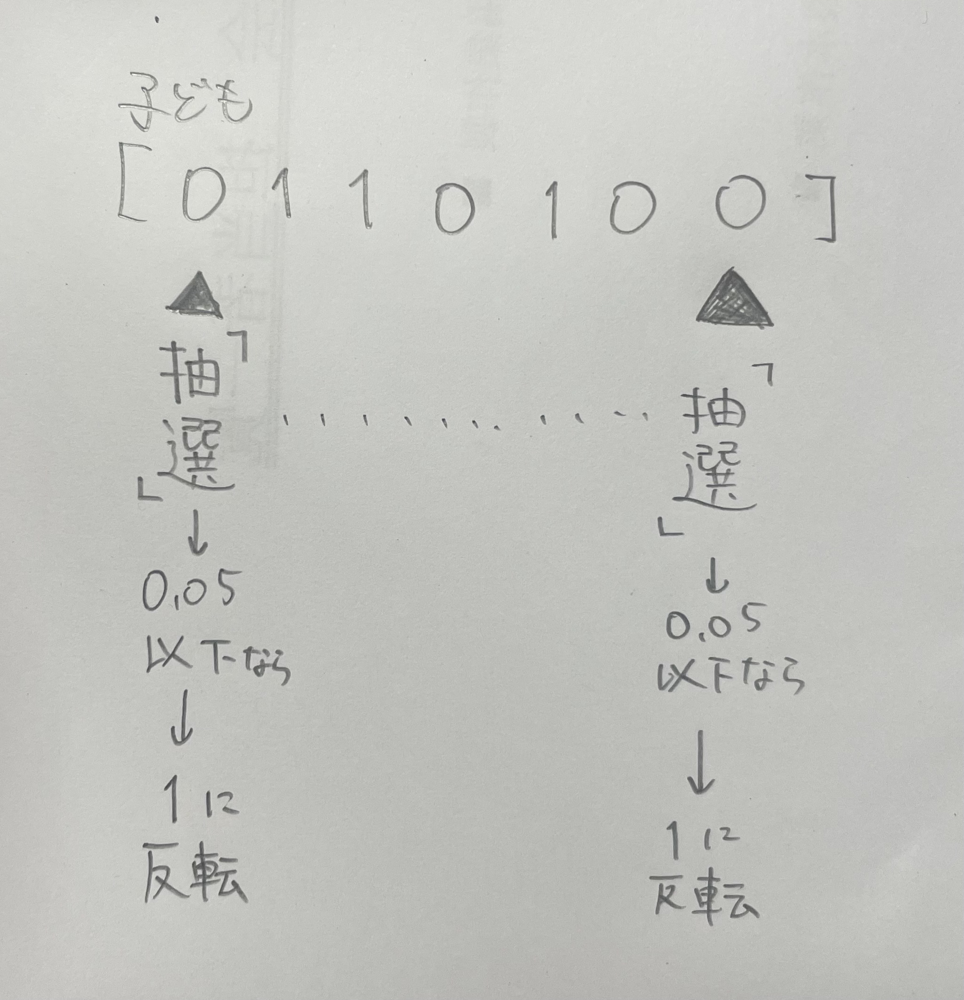

# メディア情報工学特論Ⅲ
## 今後実現したいこと
## ✅は完了の意味
- 第４回までの課題
- 「突然変異」
  - 生成した子どもの各要素に範囲０～１の乱数を生成し、その値が0.05（5%）以下であればその要素の０，１を反転させるプログラム✅
  
- 「one-max」
  - 1の数が多いほど評価値が上がる関数。フロイド問題と違い、評価値の値が大きいほど良いとされる✅
- 「親の選び方（ルーレット法かトーナメント法か）」
  - ルーレット法で今のところ思いついているのは、generation0で生み出した親の評価値について割合を算出する。フロイド問題において、誤差の範囲は０～「１～ｎまでの平方根の和」なので、その範囲を１００としたときにその親の評価値がどのくらいの割合になるか変換して、その確率に基づき親を選択する
- エリート保存
  - 親の中から一番良い評価値の個体を次の世代にそのまま引き継ぐ
- 各世代の評価値を比べ、前の世代よりも評価値が良ければその評価値に当たる子のデータを次の世代に保存する。